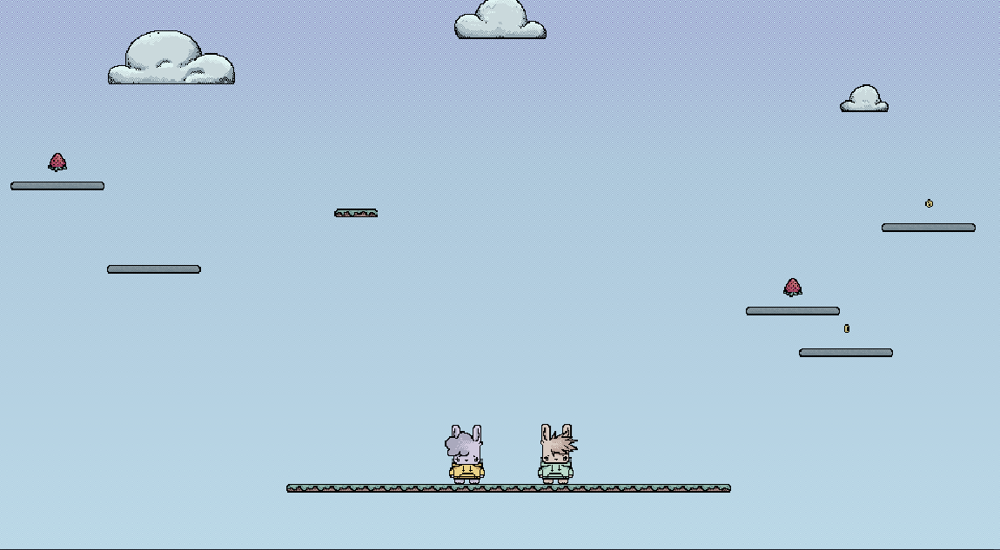

# Zečići (Bunnies)



**Zečići** (translated as "Bunnies") is a fast-paced, competitive platformer game designed for 2-4 players on a single PC. Inspired by games like *Fireboy and Watergirl* even though its not similar in tearms of gameplay, this game challenges players to outlast their opponents as they navigate an ever-rising world of randomly generated platforms.

## Gameplay

In **Zečići**, you and your friends play as adorable bunnies with one goal: **be the last bunny standing**!

### Key Features
- **Local Multiplayer**: Play with 2-4 players on the same keyboard. Jump, dodge, and outmaneuver your friends to win.
- **Survival Mode**: The camera continuously moves upward, and players must keep jumping to higher platforms to stay on the screen. Falling off means you're out of the game!
- **Randomly Generated Platforms**: Each game is unique with randomly generated platforms that keep the gameplay fresh and unpredictable.
- **Player Interaction**: Push and bump into other players to knock them off platforms. Use strategy and timing to eliminate your competition.
- **Platform Effects**: Some platforms have special properties—like slowing down players or giving them temporary abilities.
- **Power-Ups and Items**: Collect items that can change your bunny's skin or grant you special abilities, providing a competitive edge.

## Objective

The objective of the game is simple: **stay alive and outlast your opponents**. The last bunny remaining wins the game!

Are you ready to hop to victory? Let the best bunny win!

## Game Stats

- **Development Status**: In Progress
- **Current Version**: Alpha
- **Platform**: PC
- **Players**: 2-4 (Local Multiplayer)
- **Release Date**: TBA

## Installation

1. Clone this repository:
   ```bash
   git clone https://github.com/yourusername/zecici.git
2. Open the project in Godot Engine.
3. Run the game from the editor.

